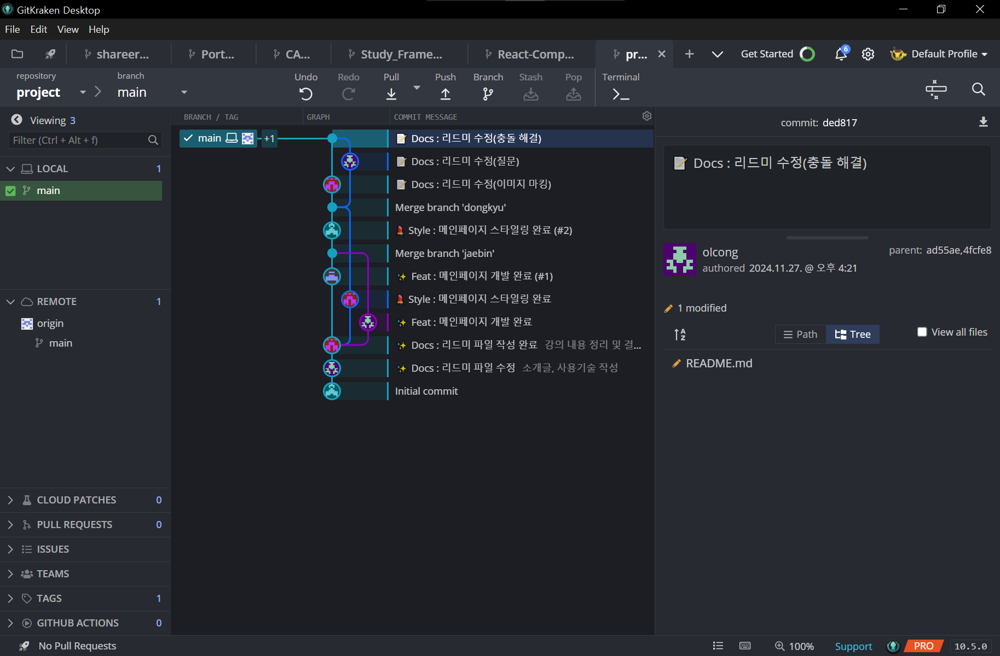

# 오픈소스 SW활용 소개 페이지 제작

 

## 프로젝트 소개
오픈소스 SW활용 과목에서 학습한 내용을 바탕으로 협업하여 과목 소개 페이지를 제작합니다. 본 프로젝트는 HTML과 CSS를 활용하여 웹 페이지를 제작하고, Git을 통한 협업 과정을 학습 및 적용하는 데 중점을 둡니다.

 

## 사용 기술
- **HTML**
- **CSS**

 

## 강의 내용 정리
1. **리드미 작성(마크다운)법**  
   - 깔끔한 프로젝트 문서화를 위한 기본 마크다운 작성법 학습.
2. **HTML, CSS로 강의 소개 페이지 제작**  
   - 간단한 웹 페이지를 설계하고 스타일링.
3. **브랜치 생성**  
   - 협업 환경에서 독립적인 작업을 위한 브랜치 생성 방법.
4. **커밋**  
   - 작업 내용을 기록하는 방법과 효과적인 메시지 작성.
5. **푸쉬**  
   - 원격 저장소에 작업 결과를 업로드.
6. **풀, 브랜치, 충돌 해결**  
   - 최신 내용을 동기화하고 충돌을 해결하는 방법.
7. **PR, 리뷰, 머지, 리베이스 사용법 및 사용 이유**  
   - 협업 과정에서 PR 생성, 코드 리뷰, 병합, 리베이스를 활용하는 이유와 방법.
8. **태그 붙이기**  
   - 프로젝트 릴리즈 관리와 특정 시점 기록을 위한 태그 활용법.

 

## 결과물
1. **페이지**  
오픈소스 SW활용 과목을 소개하는 웹 페이지
<a href="https://opensource-practice.github.io/project/" target="_blank">

.png)

</a>

[웹 페이지 링크](https://opensource-practice.github.io/project/)

 

2. **깃크라켄 그래프**  
프로젝트의 Git 기록과 협업 과정을 시각적으로 확인 가능한 그래프

